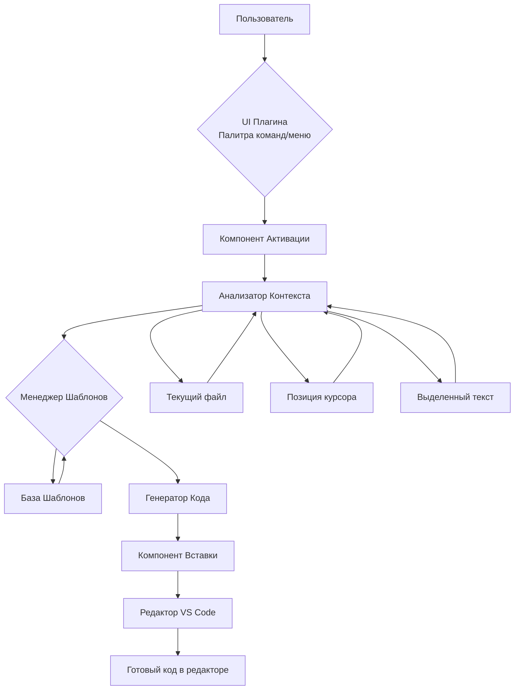

### **Блок-схема работы плагина:**
```markdown
ВАШЕ ДЕЙСТВИЕ -> VS CODE -> ПЛАГИН -> РЕДАКТОР -> РЕЗУЛЬТАТ
     |             |          |          |           |
   Нажатие     Передает   Вставляет  Показывает    Видите
   клавиш      команду       код     сообщение     if-блок
```
### Основные шаги:
```markdown
[ПОЛЬЗОВАТЕЛЬ]
│
▼ Нажимает Ctrl+Shift+I
│
▼
[VS CODE]
│
▼ Запускает команду плагина
│
▼
[ПЛАГИН АКТИВИРУЕТСЯ]
│
▼ Проверяет: открыт ли файл?
│
├─❌ НЕТ --- [ОШИБКА: "Нет открытого файла!"]
│
▼ ✅ ДА
│
[ПЛАГИН СМОТРИТ ГДЕ КУРСОР]
│
▼
[ВСТАВЛЯЕТ if-БЛОК]
|
│ if (condition) {
│ █
│ }
│
▼
[ПОКАЗЫВАЕТ: "IF ВСТАВЛЕН!"]
│
▼
[ПЛАГИН ДЕАКТИВИРУЕТСЯ]
│
▼ Ждет следующего нажатия Ctrl+Shift+I
```

# Архитектура плагина CodeGenius

## Диаграмма компонентов



## Описание компонентов

### UI Плагина
- Интерфейс взаимодействия с пользователем
- Палитра команд (Ctrl+Shift+P)
- Контекстное меню

### Анализатор Контекста  
- Анализирует код вокруг курсора
- Определяет язык программирования
- Считывает выделенный текст

### Менеджер Шаблонов
- Управляет базой шаблонов
- Фильтрует подходящие шаблоны по контексту

### Генератор Кода
- Создает готовый код из шаблонов
- Подставляет переменные
- Форматирует код